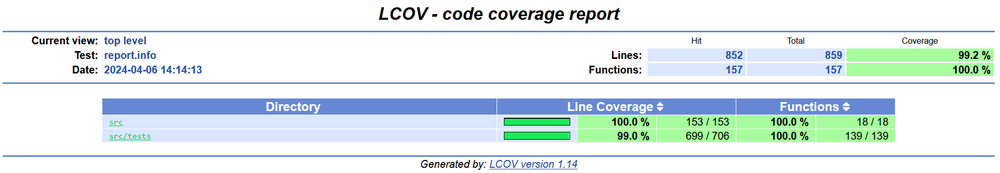

# s21_math

Реализация собственной версии математической библиотеки math.h.

## Contents

1.  [Introduction](#introduction)
2.  [Information](#information)
3.  [Project description](#project-description)

## Introduction

В данном проекте разработана своя версия стандартной библиотеки math.h на языке программирования Си. Эта библиотека реализует базовые математические операции, которые затем используются в различных алгоритмах.

## Information

Математические операции на языке Си представляют собой группу функций в стандартной библиотеке языка программирования Си, реализующих основные математические функции. Все функции так или иначе используют числа с плавающей запятой. Различные стандарты C предоставляют различные, хотя и обратно совместимые, наборы функций. Любые функции, которые работают с углами, используют радианы в качестве единицы измерения угла.  

### Описание реализованных функций "math.h"

| No. | Function | Description |
| --- | -------- | ----------- |
| 1 | `int abs(int x)` | вычисляет абсолютное значение целого числа |
| 2 | `long double acos(double x)` | вычисляет арккосинус |
| 3 | `long double asin(double x)` | вычисляет арксинус |
| 4 | `long double atan(double x)` | вычисляет арктангенс |
| 5 | `long double ceil(double x)` | возвращает ближайшее целое число, не меньшее заданного значения |
| 6 | `long double cos(double x)` | вычисляет косинус |
| 7 | `long double exp(double x)` | возвращает значение e, возведенное в заданную степень |
| 8 | `long double fabs(double x)` | вычисляет абсолютное значение числа с плавающей точкой |
| 9 | `long double floor(double x)` | возвращает ближайшее целое число, не превышающее заданное значение |
| 10 | `long double fmod(double x, double y)` | остаток операции деления с плавающей точкой |
| 11 | `long double log(double x)` | вычисляет натуральный логарифм |
| 12 | `long double pow(double base, double exp)` | возводит число в заданную степень |
| 13 | `long double sin(double x)` | вычисляет синус |
| 14 | `long double sqrt(double x)` | вычисляет квадратный корень |
| 15 | `long double tan(double x)` | вычисляет тангенс |  

## Project description

- Библиотека должна быть разработана **на языке Си** стандарта C11 с использованием компиятора gcc 
- Решение оформлено как статическая библиотека (с заголовочным файлом s21_math.h)
- Подготовлено полное **покрытие unit-тестами** функций библиотеки c помощью библиотеки **Check**
- Unit-тесты проверяют результаты работы моей реализации путём сравнения ее с реализацией стандартной библиотеки math.h
- Предусмотрен Makefile для сборки библиотеки и тестов (с целями all, clean, test, s21_math.a, gcov_report)  
- В цели gcov_report формируется отчёт gcov в виде html страницы. Для этого unit-тесты должны запускаться с флагами gcov 

- Общая проверяемая точность - 16 значащих цифр
- Проверяемая точность дробной части - максимум 6 знаков после запятой.
